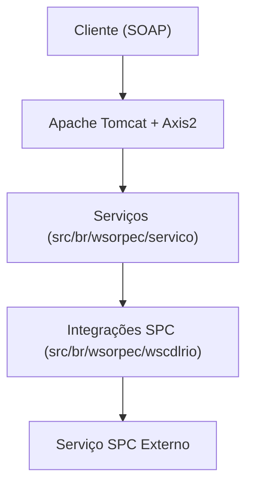

# Documentação Técnica - Webservices SPC

## Índice
- [1. Visão Geral do Sistema](#1-visão-geral-do-sistema)
- [2. Arquitetura Geral](#2-arquitetura-geral)
- [3. Estrutura do Projeto](#3-estrutura-do-projeto)
- [4. Principais Classes e Responsabilidades](#4-principais-classes-e-responsabilidades)
- [5. Padrões de Design Utilizados](#5-padrões-de-design-utilizados)
- [6. Configurações](#6-configurações)
- [7. Instalação e Deploy](#7-instalação-e-deploy)
- [8. Testes e Validação](#8-testes-e-validação)
- [9. Troubleshooting](#9-troubleshooting)
- [10. Manutenção](#10-manutenção)
- [11. Diagramas](#11-diagramas)

---

## 1. Visão Geral do Sistema
Sistema legado para consultas a produtos do SPC, exposto via webservices SOAP (Axis2) em ambiente Tomcat.

## 2. Arquitetura Geral
- Backend Java 8
- Webservices SOAP (Axis2)
- Deploy em Apache Tomcat
- Integração com SPC via módulos dedicados



## 3. Estrutura do Projeto
```
wsorpec/
  ├── src/br/wsorpec/servico/         # Serviços expostos (endpoints)
  ├── src/br/wsorpec/wscdlrio/        # Integrações e módulos de negócio
  ├── WebContent/WEB-INF/             # Configurações do Tomcat/Axis2
  └── ...
```

## 4. Principais Classes e Responsabilidades
- `src/br/wsorpec/servico/`: Serviços SOAP expostos
- `src/br/wsorpec/wscdlrio/`: Integrações e lógica de negócio SPC
- `WebContent/WEB-INF/web.xml`: Configuração do servlet Axis2
- `WebContent/WEB-INF/conf/axis2.xml`: Configuração global do Axis2
- `WebContent/WEB-INF/services/`: Serviços Axis2 e arquivos services.xml

## 5. Padrões de Design Utilizados
- Separação de serviços (endpoint) e integrações
- Utilização de Axis2 para exposição de webservices

(As próximas seções detalharão endpoints, configurações, segurança, performance, etc.) 

# 6. Configurações
(Conteúdo da seção de configurações)

# 7. Instalação e Deploy
(Conteúdo da seção de instalação e deploy)

# 8. Testes e Validação
(Conteúdo da seção de testes e validação)

# 9. Troubleshooting
(Conteúdo da seção de troubleshooting)

# 10. Manutenção
(Conteúdo da seção de manutenção)

# 11. Diagramas
(Conteúdo da seção de diagramas) 