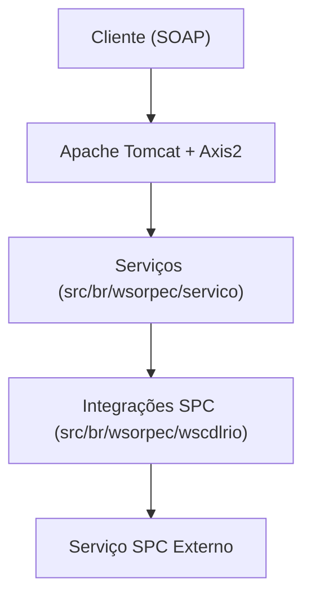

# 🛠️ Documentação Técnica - Webservices SPC

## 📖 Sumário
- [Visão Geral do Sistema](#visão-geral-do-sistema)
- [Arquitetura Geral](#arquitetura-geral)
- [Estrutura do Projeto](#estrutura-do-projeto)
- [Principais Classes e Responsabilidades](#principais-classes-e-responsabilidades)
- [Padrões de Design Utilizados](#padrões-de-design-utilizados)
- [Configurações](#configurações)
- [Instalação e Deploy](#instalação-e-deploy)
- [Testes e Validação](#testes-e-validação)
- [Troubleshooting](#troubleshooting)
- [Manutenção](#manutenção)
- [Diagramas](#diagramas)

---

## 🧪 Portal de Testes para Desenvolvedores

O sistema inclui uma interface web de testes localizada em [`html/index.html`](html/index.html).

- **Acesso:** Abra o arquivo em seu navegador.
- **Funcionalidade:** Navegue pelos links para acessar as telas de teste de cada serviço.
- **Uso recomendado:**
  - Testes manuais de integração
  - Validação de respostas SOAP/XML
  - Simulação de cenários de erro e sucesso

---

## 1. 👀 Visão Geral do Sistema
Sistema legado para consultas a produtos do SPC, exposto via webservices SOAP (Axis2) em ambiente Tomcat.

## 2. 🏗️ Arquitetura Geral
- Backend Java 8
- Webservices SOAP (Axis2)
- Deploy em Apache Tomcat
- Integração com SPC via módulos dedicados



## 3. 🗂️ Estrutura do Projeto
```text
wsorpec/
  ├── src/br/wsorpec/servico/         # Serviços expostos (endpoints)
  ├── src/br/wsorpec/wscdlrio/        # Integrações e módulos de negócio
  ├── WebContent/WEB-INF/             # Configurações do Tomcat/Axis2
  └── ...
```

## 4. 🧩 Principais Classes e Responsabilidades
- `src/br/wsorpec/servico/`: Serviços SOAP expostos
- `src/br/wsorpec/wscdlrio/`: Integrações e lógica de negócio SPC
- `WebContent/WEB-INF/web.xml`: Configuração do servlet Axis2
- `WebContent/WEB-INF/conf/axis2.xml`: Configuração global do Axis2
- `WebContent/WEB-INF/services/`: Serviços Axis2 e arquivos services.xml

## 5. 🏷️ Padrões de Design Utilizados
- Separação de serviços (endpoint) e integrações
- Utilização de Axis2 para exposição de webservices

---

> ⚠️ As próximas seções detalharão endpoints, configurações, segurança, performance, etc.

---

## 6. ⚙️ Configurações
(Conteúdo da seção de configurações)

## 7. 🚀 Instalação e Deploy
(Conteúdo da seção de instalação e deploy)

## 8. 🧪 Testes e Validação
(Conteúdo da seção de testes e validação)

## 9. 🛠️ Troubleshooting
(Conteúdo da seção de troubleshooting)

## 10. 🔄 Manutenção
(Conteúdo da seção de manutenção)

## 11. 🗺️ Diagramas
(Conteúdo da seção de diagramas) 