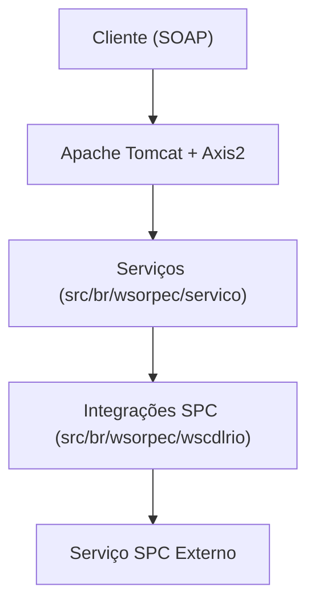

# 🛠️ Documentação Técnica - Webservices SPC

## 📖 Sumário
- [Visao Geral do Sistema](#1-visao-geral-do-sistema)
- [Arquitetura Geral](#2-arquitetura-geral)
- [Estrutura do Projeto](#3-estrutura-do-projeto)
- [Principais Classes e Responsabilidades](#4-principais-classes-e-responsabilidades)
- [Padroes de Design Utilizados](#5-padroes-de-design-utilizados)
- [Configuracoes](#6-configuracoes)
- [Instalacao e Deploy](#7-instalacao-e-deploy)
- [Testes e Validacao](#8-testes-e-validacao)
- [Troubleshooting](#9-troubleshooting)
- [Manutencao](#10-manutencao)
- [Diagramas](#11-diagramas)

---

## 🧪 Portal de Testes para Desenvolvedores

O sistema inclui uma interface web de testes localizada em [`html/index.html`](html/index.html).

- **Acesso:** Abra o arquivo em seu navegador.
- **Funcionalidade:** Navegue pelos links para acessar as telas de teste de cada serviço.
- **Uso recomendado:**
  - Testes manuais de integração
  - Validação de respostas SOAP/XML
  - Simulação de cenários de erro e sucesso

---

## 1. Visao Geral do Sistema
Sistema legado para consultas a produtos do SPC, exposto via webservices SOAP (Axis2) em ambiente Tomcat.

## 2. Arquitetura Geral
- Backend Java 8
- Webservices SOAP (Axis2)
- Deploy em Apache Tomcat
- Integração com SPC via módulos dedicados



## 3. Estrutura do Projeto
```text
wsorpec/
  ├── src/br/wsorpec/servico/         # Serviços expostos (endpoints)
  ├── src/br/wsorpec/wscdlrio/        # Integrações e módulos de negócio
  ├── WebContent/WEB-INF/             # Configurações do Tomcat/Axis2
  └── ...
```

## 4. Principais Classes e Responsabilidades
- `src/br/wsorpec/servico/`: Serviços SOAP expostos
- `src/br/wsorpec/wscdlrio/`: Integrações e lógica de negócio SPC
- `WebContent/WEB-INF/web.xml`: Configuração do servlet Axis2
- `WebContent/WEB-INF/conf/axis2.xml`: Configuração global do Axis2
- `WebContent/WEB-INF/services/`: Serviços Axis2 e arquivos services.xml

## 5. Padroes de Design Utilizados
- Separação de serviços (endpoint) e integrações
- Utilização de Axis2 para exposição de webservices

---

> ⚠️ As próximas seções detalham endpoints, configurações, segurança, performance, etc.

---

## 6. Configuracoes
As principais configurações do sistema estão em:
- **Arquivo de parâmetros:** `wsorpec.conf` na raiz do projeto. Define conexões de banco, diretórios de log, URLs de integrações, credenciais e tempo de cache.
  - Exemplo de parâmetros:
    ```
    DRVBANCO = net.sourceforge.jtds.jdbc.Driver
    URLBANCO = jdbc:jtds:sqlserver://<host>:<porta>;databaseName=<nome>
    USRBANCO = <usuario>
    PWRBANCO = <senha>
    PASTALOG = /logwsorpec/WSorpec
    URLCDLRIO = https://www.scpc.inf.br/cgi-bin/spcaxml
    ...
    ```
- **Configuração do Axis2:**
  - `WebContent/WEB-INF/conf/axis2.xml` — parâmetros do Axis2, hot deployment, módulos, listeners, etc.
- **Configuração do Tomcat:**
  - `WebContent/WEB-INF/web.xml` — mapeamento de servlets, páginas de erro, arquivos de boas-vindas.

> ℹ️ **Dica:** Sempre reinicie o Tomcat após alterações em arquivos de configuração.

## 7. Instalacao e Deploy
Veja também o [Guia de Deploy](./DEPLOYMENT_GUIDE.md) para detalhes completos.

**Passos principais:**
1. Instale Java 8, Tomcat 8/9 e Axis2.
2. Configure o `wsorpec.conf` conforme ambiente.
3. Compile o projeto usando Ant:
   ```bash
   ant -buildfile build.xml
   ```
4. Gere o WAR:
   ```bash
   jar -cvf wsorpec.war -C WebContent/ .
   ```
5. Faça o deploy do WAR no Tomcat (`webapps/`).
6. Reinicie o Tomcat e acesse `http://<servidor>:8080/wsorpec/services/`.

> 💡 Consulte logs em caso de erro: `logs/catalina.out`, `logwsorpec/`, etc.

## 8. Testes e Validacao
- **Testes manuais:**
  - Use o portal de testes em [`html/index.html`](html/index.html) para simular chamadas aos serviços.
  - Valide respostas SOAP/XML e JSON.
- **Testes automatizados:**
  - O projeto pode ser testado via scripts de integração (ex: SoapUI, Postman) usando os endpoints SOAP expostos.
- **Testes de build:**
  - O `build.xml` possui targets para compilar e empacotar o projeto.

> ℹ️ **Dica:** Sempre valide credenciais e parâmetros antes de testar integrações.

## 9. Troubleshooting
Veja também o [TROUBLESHOOTING.md](./TROUBLESHOOTING.md) para problemas comuns.

- **Serviço não aparece no Axis2:**
  - Verifique `services.xml` e classes compiladas.
  - Reinicie o Tomcat após alterações.
- **Erro 404/500:**
  - Confirme a URL e consulte logs do Tomcat e do sistema.
- **Falha de autenticação:**
  - Verifique `codigo` e `senha` enviados.
  - Valide junto ao SPC se as credenciais estão ativas.
- **Timeout ou lentidão:**
  - Monitore recursos do servidor e consulte logs.
- **Logs importantes:**
  - Tomcat: `logs/catalina.out`, `logs/localhost.*.log`
  - Sistema: `logwsorpec/`
  - Axis2: conforme configuração

## 10. Manutencao
- **Backup:**
  - Faça backup regular dos arquivos de configuração e logs.
- **Limpeza de logs:**
  - Monitore e limpe periodicamente o diretório `logwsorpec/` para evitar consumo excessivo de disco.
- **Atualização de dependências:**
  - Atualize bibliotecas Java e Axis2 conforme necessário.
- **Revisão de credenciais:**
  - Altere senhas padrão e restrinja acesso à administração do Axis2.
- **Monitoramento:**
  - Utilize ferramentas de monitoramento do Tomcat e do sistema operacional.

## 11. Diagramas
- **Diagrama de arquitetura:** (ver seção 2)
- **Fluxo de autenticação e consulta:**

```mermaid
graph LR;
  Usuario[Usuário] --> ["Chamada SOAP"] --> Servico[Serviço SOAP]
  Servico --> Autenticacao[Autenticação]
  Servico --> Banco[Banco de Dados]
  Servico --> IntegracaoSPC[Integração SPC/CDLRio/CrediOnline]
  Servico --> Log[Log]
  Servico --> Cache[Cache]
  Servico --> ["Resposta SOAP/JSON"] --> Usuario
```

> ℹ️ Para mais diagramas, consulte a seção de arquitetura ou crie fluxos específicos conforme necessidade. 